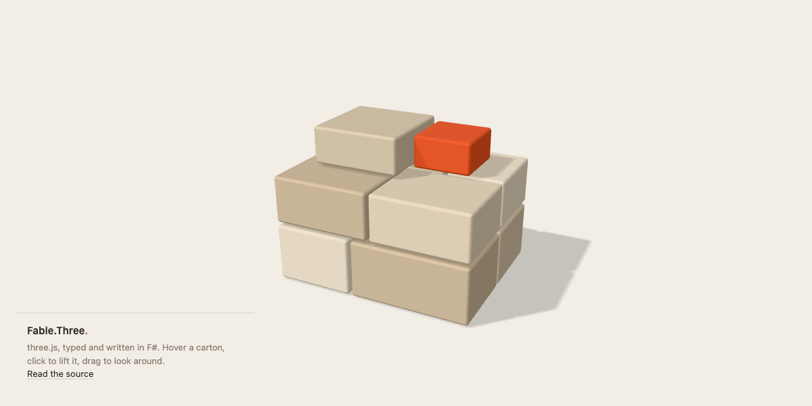

# Fable.Three

[](https://github.com/OnurGumus/Fable.Three/actions/workflows/ci.yml)
[](https://www.nuget.org/packages/Fable.Three)

**Write [three.js](https://threejs.org) 3D scenes in F#.**

Fable.Three lets you use three.js from [Fable](https://fable.io), the F#-to-JavaScript compiler.
Every three.js class, method and option has an F# type. Your editor autocompletes them and shows
three.js's own documentation as you type, and the compiler catches mistakes before you open a
browser. The JavaScript that comes out is what you would have written by hand.

[](https://onurgumus.github.io/Fable.Three/)

**[Try the demo](https://onurgumus.github.io/Fable.Three/)**. It is [one F# file](demo/App.fs).

## Getting started

You need the [.NET SDK](https://dotnet.microsoft.com/download) (8 or later) and
[Node.js](https://nodejs.org) (18 or later). These steps take you from an empty folder to a
turning cube.

**1. Create a folder and install the tools.**

```sh
mkdir hello-three && cd hello-three
dotnet new tool-manifest
dotnet tool install fable
npm init -y
npm install three@0.186 vite
```

Fable turns your F# into JavaScript. Vite serves the page and reloads it when the code changes.

**2. Add three files.**

`App.fsproj`, the F# project:

```xml
<Project Sdk="Microsoft.NET.Sdk">
  <PropertyGroup>
    <TargetFramework>net8.0</TargetFramework>
  </PropertyGroup>
  <ItemGroup>
    <Compile Include="App.fs" />
  </ItemGroup>
  <ItemGroup>
    <PackageReference Include="Fable.Three" Version="0.186.*" />
  </ItemGroup>
</Project>
```

`App.fs`, the scene:

```fsharp
module App

open Browser
open Three

// A scene, a camera to look at it, and a renderer that draws into the page.
let scene = Scene()
scene.background <- Color(0xf2eee6)

let camera = PerspectiveCamera(50, window.innerWidth / window.innerHeight, 0.1, 100)
camera.position.z <- 3.

let renderer = WebGLRenderer(antialias = true)
renderer.setSize(window.innerWidth, window.innerHeight)
document.body.appendChild(renderer.domElement) |> ignore

// A cube, and light to see it by.
let cube = Mesh(BoxGeometry(1, 1, 1), MeshStandardMaterial(color = 0xd4532e))
let sun = DirectionalLight(0xffffff, 3)
sun.position.set(1, 2, 3) |> ignore
scene.add(cube, sun, AmbientLight(0xffffff, 0.5)) |> ignore

// Turn the cube a little on every frame.
renderer.setAnimationLoop(fun time ->
    cube.rotation.x <- time / 2000.
    cube.rotation.y <- time / 1000.
    renderer.render(scene, camera))
```

`index.html`, the page that loads it:

```html
<!doctype html>
<html>
  <body style="margin: 0">
    <script type="module" src="./build/App.js"></script>
  </body>
</html>
```

**3. Run it.**

```sh
dotnet fable watch -o build --run npx vite
```

Open http://localhost:5173 and you should see an orange cube turning. Change something in
`App.fs`, save, and the page reloads with your change.

### Adding it to an existing Fable project

```sh
dotnet add package Fable.Three
npm install three@0.186
```

With Paket, it's `paket add Fable.Three` instead. With [Femto](https://github.com/Zaid-Ajaj/Femto),
running `dotnet femto` installs the matching three.js for you.

## From JavaScript to F#

If you know three.js, you already know Fable.Three: the classes, methods and properties have the
same names. What changes is the F# syntax.

| JavaScript | F# |
|---|---|
| `new THREE.Mesh(geometry, material)` | `Mesh(geometry, material)` |
| `new THREE.MeshStandardMaterial({ color: 0xff0000 })` | `MeshStandardMaterial(color = 0xff0000)` |
| `mesh.position.x = 2` | `mesh.position.x <- 2.` |
| `material.side = THREE.DoubleSide` | `material.side <- Side.DoubleSide` |
| `import { OrbitControls } from "three/addons/controls/OrbitControls.js"` | `open Three.Addons` |
| `if (object instanceof THREE.Mesh)` | `match object with :? Mesh as mesh -> ...` |

The rest of this section goes through each of these.

### Creating objects

Leave out `new` and `THREE.`:

```fsharp
let geometry = BoxGeometry(1, 1, 1)
let mesh = Mesh(geometry, MeshNormalMaterial())
```

### Options become named arguments

Where three.js takes a settings object, such as `{ color: 0xff0000, roughness: 0.5 }`, you pass
the settings as named arguments. Leave out any you don't need.

```fsharp
let material = MeshStandardMaterial(color = 0xff0000, roughness = 0.5, metalness = 0.1)
let renderer = WebGLRenderer(antialias = true, alpha = true)
```

A colour can be a hex number (`0xff0000`), a CSS colour (`"tomato"`, `"#ff6347"`) or a `Color`.

### Setting properties and calling methods

Properties are set with `<-`:

```fsharp
mesh.position.x <- 2.
material.transparent <- true
```

Many three.js methods return the object they were called on so JavaScript can chain them, for
example `position.set(1, 2, 3)` or `scene.add(mesh)`. F# asks you to say when you're not using a
result, so put `|> ignore` after them:

```fsharp
mesh.position.set(1, 2, 3) |> ignore
scene.add(mesh) |> ignore
```

### Constants

three.js constants are grouped by what they're for. Type the group name and a dot, and your
editor lists the choices:

```fsharp
material.side <- Side.DoubleSide
texture.wrapS <- Wrapping.RepeatWrapping
renderer.toneMapping <- ToneMapping.ACESFilmicToneMapping
```

A few three.js properties are declared as plain strings or numbers. For those, use the constant
of the same name from the `Constants` module:

```fsharp
renderer.outputColorSpace <- Constants.SRGBColorSpace
```

### Addons

Everything three.js ships under `three/addons` is in `Three.Addons`: camera controls, model
loaders, post-processing, 2D and 3D labels and more. Each one is imported from its own file, so
your bundle only contains the ones you use.

```fsharp
open Three.Addons

let controls = OrbitControls(camera, renderer.domElement)
controls.enableDamping <- true
```

### Loading textures and models

Callbacks are ordinary F# functions, and their argument has the right type:

```fsharp
let crate = TextureLoader().load("crate.png")

GLTFLoader().load("robot.glb", fun gltf -> scene.add(gltf.scene) |> ignore)
```

With the [Fable.Promise](https://github.com/fable-compiler/fable-promise) package you can use
`loadAsync` instead:

```fsharp
promise {
    let! gltf = GLTFLoader().loadAsync("robot.glb")
    scene.add(gltf.scene) |> ignore
}
```

### Checking what kind of object you have

`:?` checks an object's type. For example, when the mouse is over a mesh:

```fsharp
let raycaster = Raycaster()

let highlight (pointer: Vector2) =
    raycaster.setFromCamera(pointer, camera)

    for hit in raycaster.intersectObjects(scene.children, true) do
        match hit.``object`` with
        | :? Mesh as mesh -> mesh.scale.setScalar(1.2) |> ignore
        | _ -> ()
```

`object` is a reserved word in F#, which is why the property is written ``` hit.``object`` ```.
The same goes for any three.js name that is also an F# keyword, such as ``` renderer.shadowMap.``type`` ```.

## Things that work a little differently

### Numbers

Every three.js number is an F# `float`. You can pass whole numbers where three.js expects one, as
in `BoxGeometry(1, 1, 1)`, but when you calculate with numbers use floats: `time / 1000.`, not
`time / 1000`.

### A mesh's material

A `Mesh` can hold any kind of material, so `mesh.material` has the general type `Material`. To
change something only a particular material has, keep your own reference to it:

```fsharp
let paint = MeshStandardMaterial(color = 0x3080ff)
let ball = Mesh(SphereGeometry(1), paint)
paint.roughness <- 0.2
```

Or tell F# which material it is:

```fsharp
(ball.material :?> MeshStandardMaterial).roughness <- 0.2
```

### Properties that take different kinds of value

Some properties accept more than one type. `scene.background`, for example, can be a `Color` or
a `Texture`, and you can assign either:

```fsharp
scene.background <- Color(0xf2eee6)
scene.background <- crate
```

When the value is a more specific kind than the property names, such as a `CubeTexture` (which is
a kind of `Texture`), F# needs a nudge. Put `!^` in front of it, which comes from
`open Fable.Core.JsInterop`:

```fsharp
scene.background <- !^ CubeTextureLoader().load(sky)
```

### Values that may be missing

An object that might be missing is `null`, as in JavaScript, so check with `isNull`. A number or
function that three.js may leave out comes back as an F# `option`.

```fsharp
if not (isNull mesh.parent) then mesh.removeFromParent() |> ignore
```

### Your own data, and shader uniforms

`userData` and a shader's `uniforms` are keyed by name, like a dictionary:

```fsharp
mesh.userData["id"] <- box 42

let shader =
    ShaderMaterial(
        uniforms = Record.ofSeq [ "time", IUniform(value = 0.) ],
        vertexShader = vertexSource,
        fragmentShader = fragmentSource
    )

shader.uniforms["time"].value <- time
```

## What's included

- **All of `three`** for the WebGL renderer: every class, material, geometry, light, loader,
  helper, curve and math type, including animation and WebXR.
- **All of `three/addons`**: controls, loaders for glTF, DRACO, KTX2, HDR, FBX, OBJ, STL and
  more, post-processing effects, 2D/3D HTML labels, thick lines, exporters and extra geometries.
- **three.js's documentation** in your editor's tooltips. Anything three.js has deprecated is
  marked, so the compiler warns you when you use it.

Not included yet: the WebGPU renderer and TSL node materials (`three/webgpu`, `three/tsl`).

Fable.Three 0.186.x is for three.js 0.186 (r186). It works with Fable 4 and 5.

## Contributing

The F# bindings are generated from three.js's TypeScript type definitions, so don't edit
`Three.fs` or `Three.Addons.fs` by hand. Change the generator in `tools/generate` instead and
regenerate:

```sh
npm ci && dotnet tool restore
npm run generate   # rewrites src/Fable.Three/Three.fs and Three.Addons.fs
npm test           # compiles the tests with Fable and runs them against three.js
npm run demo       # the demo, with live reload
```

[docs/DESIGN.md](docs/DESIGN.md) explains how TypeScript's types become F# ones, and why.

## License

MIT. three.js is © its authors and MIT licensed. The documentation comments come from
`@types/three`, also MIT.
